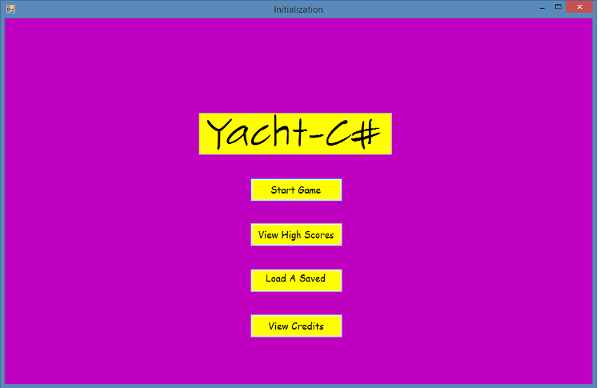
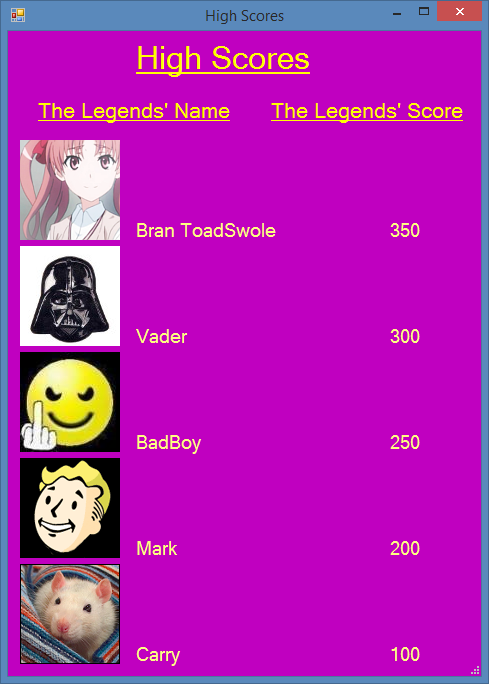
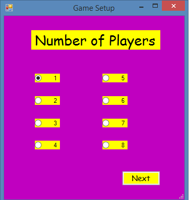
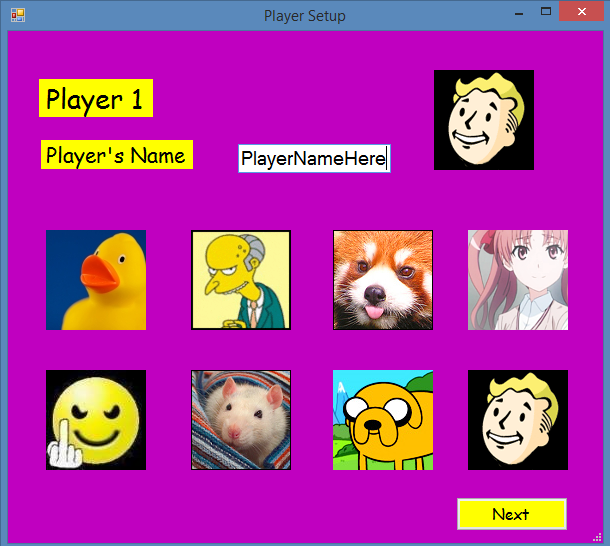
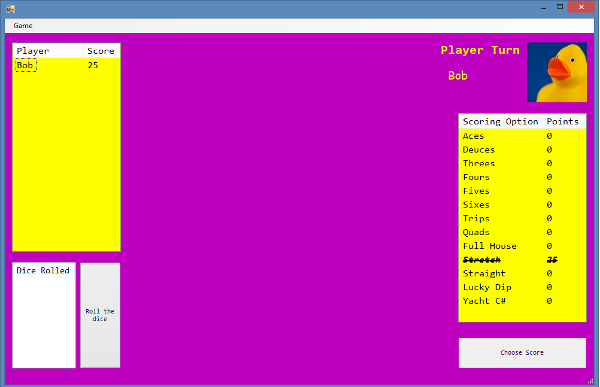
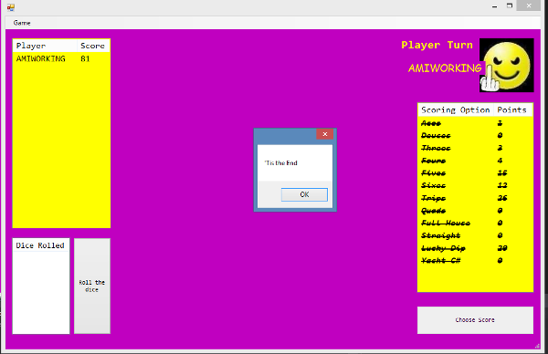

Yacht C# User Manual
===================

A Bad Boys Entertainment production
---

Yacht C# is a C# implementation of **Milton Bradley**'s **Yahtzee** and is in no way affiliated with the owners of the trademark. It is a not for profit implementation for educational purposes only 

Application Start Page
---
When the application starts it will look like this.
This form presents 4 user-chosen options.
 The manual will go over these in reverse order respective to the list.

* Start Game

* View High Scores

* Load A Saved

* View Credits <i>not yet implemented</i>

Note: This base forms will remain open as long as the application is running.
<!-- all the images folder for clarity's sake-->

View Credits
---
View Credits will display the names and roles of the Bad Boys crew!

Load A Saved
---

Load A Saved will  load the last saved game state as the current game state and allow for resumed gameplay.
 The application keeps an internal file name for the last saved game and only supports one saved game, so save wisely!

View High Scores
---

View High Scores will display a form with the top 5 current high scores.

Start Game
---
This option will start the setup in order to begin a new game.
It will ask for the number of players, then set up each player allowing the user to choose the name and avatar for each player. 

<h4>Number of Players (Game Setup)</h4>

This form allows the user to choose the number of players in the game.
  Click next to set up each individual player.

<h4>Player Setup</h4>

This form allows the user to choose the name and avatar for each player in the game.

Gameplay 
---
This section is over the gameplay of the Yacht-C# implementation of Yahtzee.
For a better understanding of the gameplay the user might want to review the [rules](images/http://www.yahtzee.org.uk/rules.html) of the game before playing.

Below is a view of the basic gameplay.

Given that the two main player decided parts of yahtzee entail holding dice and choosing scores,Yacht C# implements ways to do both.

Yacht C# has a button to roll the dice and a check-box to hold the value for each simulated dice
 The user can hold any dice they want for each roll up to three rolls, but as per the rules once a dice is held it may not be relinquished.

In Yatzee the player must choose each box on the scorecard. Each item on the score card may only be chosen once.
Yacht C# implements this by allowing the user to click on each score, which will highlight it in blue. If the score item is not present in the users dice values it's score will be zero like in the game.
Yacth C# also allows a button to actually choose the score item which will increment the users score by the items value and mark through the item so the user knows its already been chosen. The user may only choose one item per round.

At the end of the 13 rounds after all 13 score items are chosen the game will be over. 

Yacht C# displays a message to the user signifying the end of the game. If the score is high enough it will be displayed in the highscore list for all to see.

